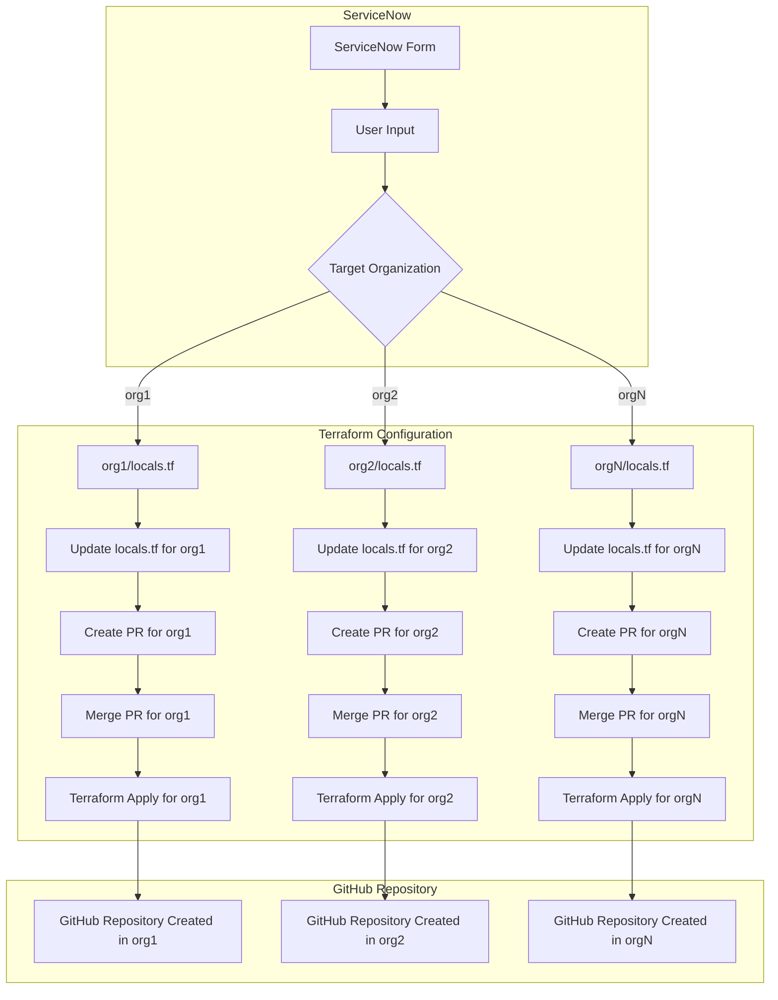

# terraform-github-repository-management-template

This is a Template of How To Manage Terraform Repositories for GitHub Organizations

- See [Automation Proposal](.AUTOMATION_PROPOSAL.md)

<details>
  <summary>Click to expand Mermaid Chart</summary>


</details>

## Automated GitHub Repository Creation

This repository automates the creation of GitHub repositories using Terraform, based on user input from a ServiceNow form. The process involves:

1. Users filling out a ServiceNow form with repository details.
2. Transforming the form data into a JSON payload.
3. Using the payload to update a Terraform `locals.tf` file in the appropriate organization directory.
4. Creating a pull request to merge the changes.
5. Applying the Terraform configuration to create the repository in the specified GitHub organization.

## Directory Structure

```bash
terraform/
├── org1/
│ ├── main.tf
│ ├── locals.tf
│ ├── providers.tf
│ ├── variables.tf
│ └── terraform.tfstate
├── org2/
│ ├── main.tf
│ ├── locals.tf
│ ├── providers.tf
│ ├── variables.tf
│ └── terraform.tfstate
└── templates/
├── python/
│ └── template.tf
├── ruby/
│ └── template.tf
└── java/
└── template.tf
```


- Each organization (`org1`, `org2`, etc.) has its own directory with Terraform configuration files.
- The `templates/` directory contains language-specific templates for repository creation.

## Workflow

1. **ServiceNow Form**:
   - Users fill out a form with repository details (e.g., organization, repository name, language, visibility).

2. **Payload Processing**:
   - The form data is transformed into a JSON payload.

3. **Update `locals.tf`**:
   - A Python script (`update_locals.py`) updates the `locals.tf` file in the appropriate organization directory.

4. **Create Pull Request**:
   - A GitHub Actions workflow creates a pull request with the changes to the `locals.tf` file.

5. **Terraform Apply**:
   - Once the PR is merged, Terraform applies the changes to create the repository in the specified GitHub organization.

## Setup

### Prerequisites

- Terraform installed locally or in your CI/CD environment.
- A GitHub personal access token with the necessary permissions for repository creation.
- Python 3.x installed for running the `update_locals.py` script.

### Configuration

1. **GitHub Token**:
   - Set up a GitHub personal access token and store it securely (e.g., as a GitHub secret or environment variable).

2. **Terraform Providers**:
   - Each organization directory contains a `providers.tf` file to configure the GitHub provider. For example:

     ```hcl
     provider "github" {
       owner = "org1"
       token = var.github_token
     }
     ```

3. **Python Script**:
   - The `update_locals.py` script updates the `locals.tf` file based on the JSON payload. Ensure the script is executable and has the necessary permissions.

4. **GitHub Actions Workflow**:
   - The `.github/workflows/create-repo-pr.yml` file defines the workflow for creating pull requests.

### Usage

1. **ServiceNow Form**:
   - Fill out the form in ServiceNow to generate a JSON payload.

2. **Run the Script**:
   - Pass the JSON payload to the `update_locals.py` script:

     ```bash
     python update_locals.py --payload payload.json
     ```

3. **Create Pull Request**:
   - The GitHub Actions workflow will automatically create a pull request with the changes.

4. **Merge and Apply**:
   - Review and merge the pull request. Terraform will apply the changes to create the repository.

## Example Payload

```json
{
  "organization": "org1",
  "repository_name": "my-new-repo",
  "description": "This is a new repository for Python projects.",
  "language": "python",
  "visibility": "private",
  "enable_issues": true,
  "enable_wiki": false
}
```

## Contributing

Contributions are welcome! Please open an issue or submit a pull request for any improvements or bug fixes.

## License

This project is licensed under the MIT License. See the LICENSE file for details.

---

### **Key Sections**
1. **Overview**: Explains the purpose of the repository.
2. **Directory Structure**: Describes the organization of files and directories.
3. **Workflow**: Outlines the steps involved in the process.
4. **Setup**: Provides instructions for configuring the repository.
5. **Usage**: Explains how to use the repository.
6. **Example Payload**: Shows an example of the JSON payload.
7. **Contributing**: Encourages contributions.
8. **License**: Specifies the license for the repository.

---

This `README.md` provides a comprehensive guide for anyone using or contributing to the repository. Let me know if you need further adjustments!